# **AeroFit Treadmill Data Analysis**

## **Project Overview**
This project analyzes customer data from AeroFit stores to extract actionable insights and trends related to treadmill purchases. The dataset contains information about products, customer demographics, and preferences, enabling us to explore factors influencing treadmill selection and usage.  

The analysis aims to answer key business questions, such as:  
- What types of customers are buying each treadmill model?  
- How do demographics like age, income, and marital status influence purchases?  
- Which product features or customer attributes drive sales for each treadmill model?  

---

## **Product Portfolio**
AeroFit offers three treadmill models with different features and pricing:
- **KP281**: Entry-level treadmill priced at $1,500.
- **KP481**: Mid-level treadmill for runners, priced at $1,750.
- **KP781**: Advanced treadmill with premium features, priced at $2,500.

---

## **Dataset Description**
The dataset `aerofit.csv` includes the following features:  
- **Product**: Purchased treadmill model (KP281, KP481, KP781).  
- **Age**: Customer's age (in years).  
- **Gender**: Male/Female.  
- **Education**: Years of education.  
- **MaritalStatus**: Single or partnered.  
- **Usage**: Average number of weekly treadmill uses.  
- **Fitness**: Self-rated fitness level (1 to 5 scale, where 1 = poor and 5 = excellent).  
- **Income**: Annual income (USD).  
- **Miles**: Expected weekly miles walked/ran.  

---

## **Key Findings and Visualizations**

1. **Univariate Analysis:**  
   - **Age**: Most customers fall within the 20-30 age range.  
   - **Income**: Higher income correlates with purchases of KP281.  

2. **Bivariate Analysis:**  
   - **Product vs Gender**: Males are more likely to purchase KP281.  
   - **Product vs Marital Status**: Partnered customers show a preference for mid-range and high-end treadmills.  

3. **Conditional Probabilities:**  
   - A high percentage of high-income customers buy KP781.  
   - Partnered customers show a higher likelihood of purchasing KP481.  

4. **Correlation Matrix:**  
   - Strong positive correlation between income and preference for high-end treadmills.  

### **Sample Visualizations**

- **Products Distribution**  
  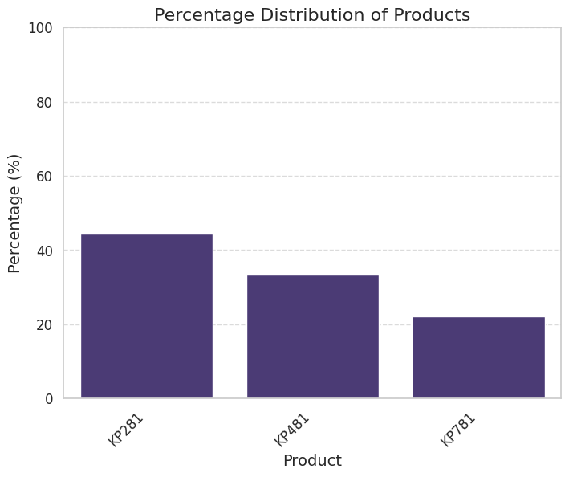

- **Product Purchased**  
  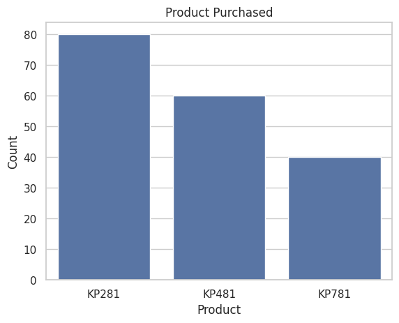 

- **Age Distribution**  
  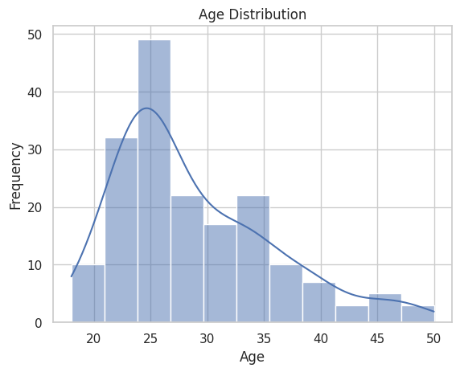  

- **Heatmap: Correlation Matrix**  
  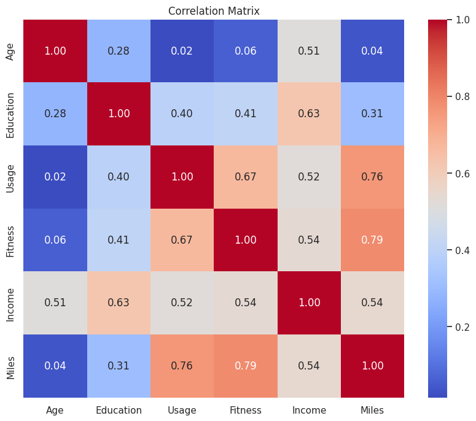

- **Pairplots**  
  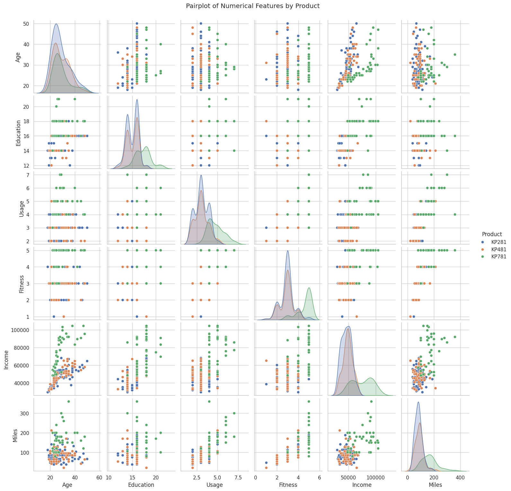

- **Age Distribution by Product**  
  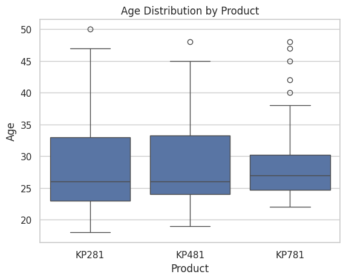

- **Education Years Distribution**  
  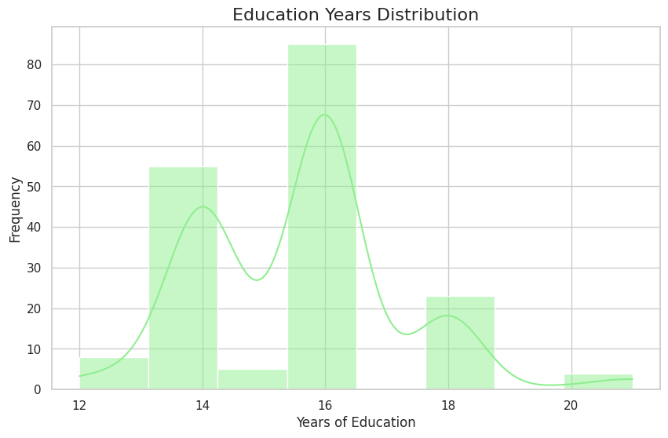

- **Fitness Levels: Self-Rated**  
  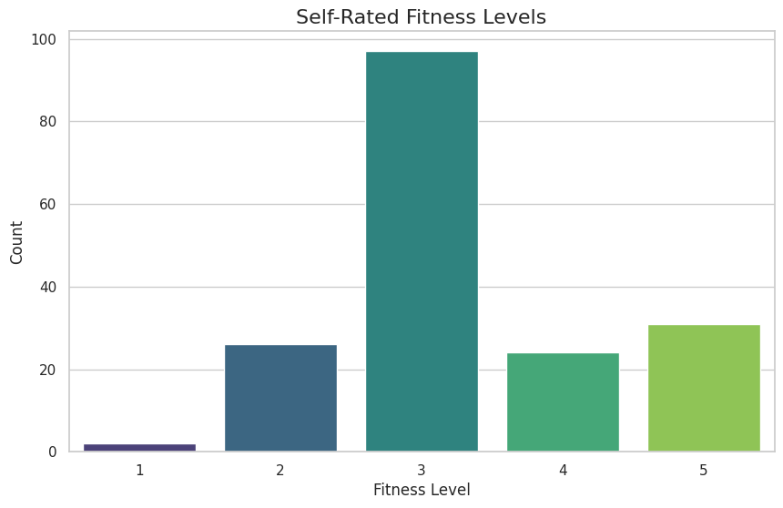

- **Income Distribution**  
  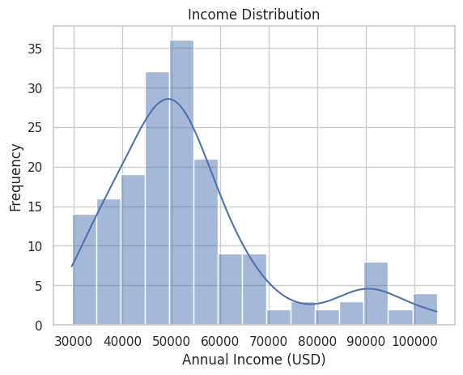

- **Box Plot: Miles Expected to Run**  
  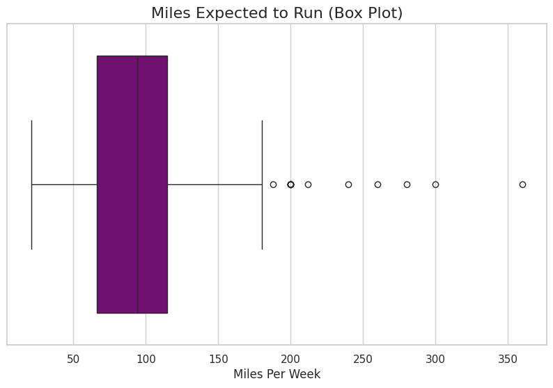

- **Income Outliers**  
  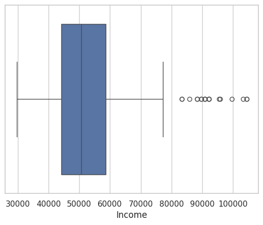

- **Partnered Customers**  
  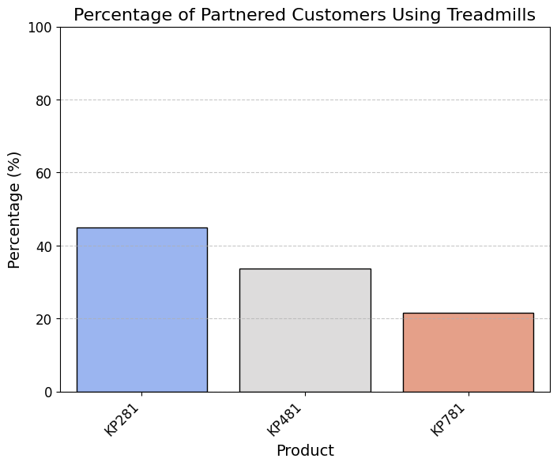

- **Age Distribution**  
   

- **Products Purchased: Marital Status**  
  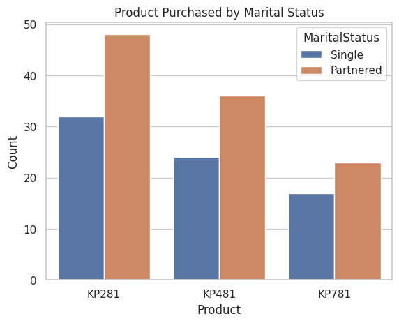

- **Treadmil Usage: Weekly**  
  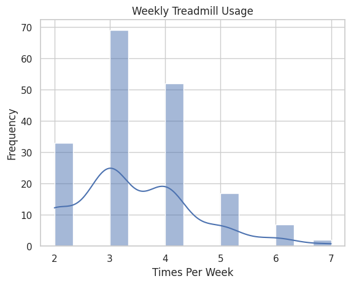
  
---

## **Steps of Analysis**
### **1. Data Exploration and Processing**
- Import the dataset and read the DataFrame.  
- Check the shape, column datatypes, and missing/duplicate values.  

### **2. Statistical Summary**
- Generate a statistical summary for both categorical and numerical features.  
- Analyze key trends in the data distribution.  

### **3. Non-Graphical Analysis**
- Perform value counts for categorical features.  
- Identify unique attributes in the dataset.  

### **4. Graphical Analysis**
#### Univariate Analysis:
- **Numerical Features**: Distribution plots, count plots, box plots.  
- **Categorical Features**: Count plots.  

#### Bivariate Analysis:
- Analyze the effect of different features on product purchases:  
  - **Product vs Gender.**  
  - **Product vs Marital Status.**  
  - **Product vs Age.**  

#### Multivariate Analysis:
- Create pair plots to visualize relationships between features.  

### **5. Correlation Analysis**
- Display the correlation matrix using a heatmap.  
- Summarize findings about strongly correlated features.  

### **6. Outlier Detection**
- Identify outliers using the IQR method and assess their impact on the analysis.  

### **7. Conditional Probabilities**
- Calculate percentages and conditional probabilities for various feature combinations, such as:  
  - **Product vs Gender**:  
    - 22.22% of females purchasing KP281.  
  - **Product vs Age**:  
    - approx. 85% of customers in their 20s or 30s purchasing treadmills.  
  - **Product vs Income**:  
    - % of high/low-income customers buying KP781.  
  - **Product vs Fitness**:  
    - % of fitness-level-5 customers buying KP781.  
  - **Product vs Marital Status**:  
    - % of partnered customers using treadmills.  

---

## 🛠️ Setup Instructions

Clone this repository:  
```bash
   git clone https://github.com/vinabi/treadmill-buyer-profile-analysis.git
   cd treadmill-buyer-profile-analysis
```
'- check the ipynb script file for analysis

---

#  If you find this project helpful, don’t forget to star the repo! 🎀

